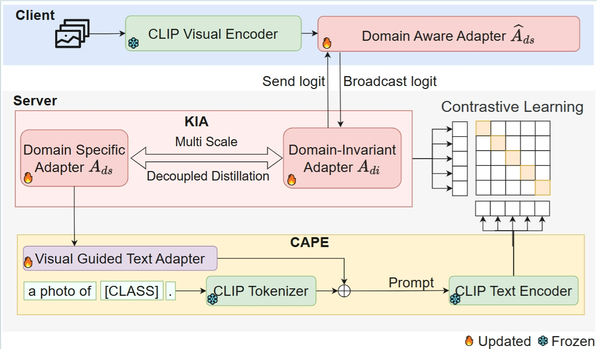

## Overview
Fed-DIP is a novel federated learning framework addressing domain shift challenges in non-IID data scenarios.
<div align="center">
    
</div>

## Installation
Create and activate conda environment
```sh
conda create -n Fed-DIP python=3.10.18
conda activate Fed-DIP
pip install -r requirements.txt
pip install git+https://github.com/openai/CLIP.git
```

## Datasets
[PACS](https://domaingeneralization.github.io/#data)

[OfficeHome](https://www.hemanthdv.org/officeHomeDataset.html)

[VLCS](https://github.com/belaalb/G2DM#download-vlcs)

[DomainNet](https://ai.bu.edu/M3SDA/)

Please put the datasets in the following directory structure:

```
├── datasets
│   ├── pacs
│   │   ├── raw_images
│   │   │   ├── art_painting
│   │   │   ├── cartoon
│   │   │   ├── photo
│   │   │   ├── sketch
│   │   ├── Train val splits and h5py files pre-read
│   ├── office_home
│   │   ├── Art
│   │   ├── Clipart
│   │   ├── Product
│   │   ├── Real_World
│   ├── vlcs
│   │   ├── Caltech101
│   │   ├── LabelMe
│   │   ├── SUN09
│   │   ├── VOC2007
│   ├── domain_net
│   │   ├── clipart
│   │   ├── infograph
│   │   ├── painting
│   │   ├── quickdraw
│   │   ├── real
│   │   ├── sketch
```

Then set the directory in the config.py and run:

## Train
Please set the root directory in the train.sh file. Then run:

```sh
sh run.sh
```

## Acknowledgments 


Part of our code is borrowed from the repositories [FedCLIP](https://github.com/HideLakitu/fedclip/tree/main/fedclip). We thank them for sharing the code.
